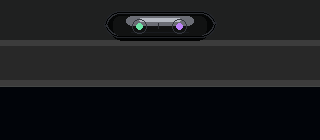

# Agent Island Monitor

Windows 顶部悬浮的 AI 状态迷你胶囊，灵感来自 Apple Dynamic Island。它用于在后台运行 Codex、Cursor/CC 时，用最小遮挡查看状态，并在需要时展开为极简控制入口。



## 功能亮点

- **默认迷你胶囊**：平时只显示极小状态点，减少遮挡浏览器标签栏、按钮和文字。
- **自动发现 Agent**：除 Codex、Cursor/CC 外，会自动识别本机常见 AI 工具窗口或进程，例如 Claude、Copilot、Windsurf、Trae、Cline 等。
- **事件展开**：Codex 开始运行、完成或需要你处理时，小岛会短暂或持续舒展开。
- **自动收回**：手动展开后 2 秒无人操作会自动回到迷你胶囊。
- **快速过渡**：迷你胶囊和展开态之间使用短动画过渡，避免生硬跳变。
- **迷你态流光提醒**：Codex 需要你处理或任务刚完成时，迷你胶囊外圈会出现同色 LED 流光，不展开也能看出有消息。
- **连点防抖**：连续快速点击会被轻量限频，避免动画反复打断造成卡顿。
- **可拖动位置**：按住小岛拖动即可移动位置，适合避开浏览器或软件顶部控件。
- **Codex 状态监控**：读取本机 Codex 日志和状态文件，显示 `Running`、`Needs You`、`Done`、`Idle`、`Offline`。
- **Cursor/CC 诚实状态**：Cursor 开着但没有证据表明 AI 在生成时显示 `Open`，不误报 `Running`。
- **双击召唤窗口**：展开态双击 `Codex` 或 `Cursor/CC` 胶囊，自动把对应窗口切到前台并最大化。
- **极简展开态**：展开后只显示短状态胶囊，不显示日志、线程列表或冗余文字。
- **托盘菜单**：支持显示/隐藏、安静模式、静音提醒、开机自启、退出。
- **无需第三方依赖**：使用 Python 标准库 + Tkinter + Win32 `ctypes` 实现。

## 状态含义

### Codex

- `Running`：检测到真实 Codex runner 或明确活跃任务。
- `Needs You`：检测到授权、确认、用户输入等明确等待用户处理的信号。
- `Done`：最近任务已完成，当前没有活跃 runner。
- `Idle`：Codex 程序存在，但没有明显任务活动。
- `Offline`：没有检测到 Codex 相关活动。

### Cursor/CC

- `Active`：Cursor 是当前前台窗口。
- `Open`：Cursor 开着但不在前台；这不代表 DeepSeek/Claude 正在生成。
- `Offline`：没有检测到 Cursor 进程。

> `Cursor/CC` 指 Cursor + CC/Claude Code 转接工作环境。本工具当前只做窗口和进程级轻量检测，不读取 DeepSeek/Claude 的内部生成状态。

### 自动发现的 Agent

- `Active`：该 Agent 窗口是当前前台窗口。
- `Open`：检测到该 Agent 的窗口或进程，但它不在前台。
- 自动发现只表示“这个工具开着”，不代表它正在思考、生成或写代码。
- 右键展开态里的候选 Agent 胶囊，可以标记为确认的 Agent，或把它加入忽略列表。

## 展开逻辑

- `Idle` / `Open` / `Offline`：保持迷你胶囊。
- `Running`：状态变化时展开约 4 秒，然后自动回到迷你胶囊。
- `Done`：完成时展开约 4 秒，显示完成反馈，然后自动回到迷你胶囊。
- `Needs You`：先展开提醒，随后回到迷你胶囊并用对应颜色的流动灯带持续提示。
- `Done`：回到迷你胶囊后，外圈短时间显示完成流光。
- 手动点击迷你胶囊：展开双状态胶囊，2 秒后自动收回。
- 展开态点击空白区域：收回迷你胶囊。

## 使用方法

### 手动启动

双击：

```powershell
start_agent_island.bat
```

### 开机自启

安装开机自启：

```powershell
powershell -ExecutionPolicy Bypass -File .\install_startup.ps1
```

取消开机自启：

```powershell
powershell -ExecutionPolicy Bypass -File .\uninstall_startup.ps1
```

### 交互

- 点击迷你胶囊：展开状态胶囊。
- 2 秒无人操作：自动收回迷你胶囊。
- 按住拖动：移动小岛位置，并自动保存。
- 右键小岛：打开小岛菜单，可恢复默认位置或关闭。
- 单击迷你胶囊：展开状态胶囊。
- 单击展开态空白区域：收回迷你胶囊。
- 双击展开态 `Codex` 胶囊：召唤 Codex 到前台并最大化。
- 双击展开态 `Cursor/CC` 胶囊：召唤 Cursor 到前台并最大化。
- 双击展开态自动发现的 Agent 胶囊：召唤对应窗口到前台并最大化。
- 双击迷你胶囊：默认召唤 Codex。
- 右键托盘图标：打开功能菜单。
- 按 `Esc`：关闭小岛。

## 配置

编辑 `config.json` 可调整：

- 刷新间隔
- 迷你胶囊尺寸
- 自定义位置
- 手动展开自动收回时间
- 大小胶囊过渡速度
- 动画开关
- 鼠标靠近自动上收备用功能
- 自动发现 Agent 开关
- 最大显示 Agent 数量
- 已确认 / 已忽略 Agent 列表
- 静音提醒
- 小岛颜色
- Codex 活跃/Needs You 判断阈值

## 当前限制

- 暂不监控 Gemini 网页端。
- Cursor/CC 和自动发现的 Agent 不读取 DeepSeek、Claude 或其他模型的内部生成状态。
- Codex 状态基于本地 sqlite/log 推断，如果 Codex 后续改变本地日志结构，需要更新监控逻辑。
- Windows 有时会限制程序强制切换前台窗口；如果点击不能切过去，通常是系统前台窗口策略限制。

## 项目文件

- `agent_island.py`：主程序。
- `config.json`：配置文件。
- `start_agent_island.bat`：手动启动脚本。
- `install_startup.ps1`：安装开机自启。
- `uninstall_startup.ps1`：取消开机自启。
- `功能说明.txt`：中文功能说明。

